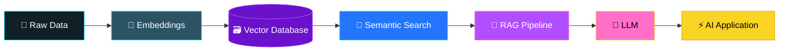

‪C:\Users\acer\Downloads\ChatGPT Image Aug 8, 2026, 0

<!-- ================= 🎨 CUSTOM ANIMATED AI BANNER (local SVG, glowing + spinning chip) ================= -->
<p align="center">
  
</p>

<!-- ================= PROFILE PHOTO ================= -->
<p align="center">
  
</p>

<p align="center">
  
</p>

<p align="center">
  <a href="https://linkedin.com/in/srisriram"></a>
  <a href="https://leetcode.com/u/SriramMuthaiya/"></a>
  <a href="https://www.codechef.com/users/srirammuthaiya"></a>
  <a href="https://codeforces.com/profile/kit29.am48"></a>
  <a href="https://codolio.com/profile/SriramMuthaiya"></a>
  <a href="mailto:kit29.am48@gmail.com"></a>
</p>

---

## 🚀 About Me

First-year **B.E. Computer Science (AI & ML)** student at **Kalaignar Karunanidhi Institute of Technology** (CGPA **8.9/10.0**), with hands-on experience across the AI/ML stack — machine learning, deep learning, generative AI, agentic AI, and CNN-based models — built using Python, NumPy, and Pandas.

- 🧪 Completed AI/ML internships with **V-DART** and **CodeAlpha** — end-to-end projects from data cleaning to model deployment
- 📊 Comfortable across the full data-analyst workflow: cleaning, visualizing, applying statistics & probability
- 🏗️ Builds full-stack + AI-assisted apps with Python, C, C++, Java, HTML, SQL, and tools like Cursor, Google AI Studio, and Lovable
- 🏆 **1400+** problems on CodeChef · **150+** on LeetCode · **10+** GitHub projects
- 📄 Submitted 10+ research paper proposals — **1 accepted for publication**
- 🎯 Seeking an internship / entry-level role to apply strong problem-solving & AI/ML development skills

---

## 🧬 Generative AI Pipeline



---

## 🎓 Education

| Institution | Program | Duration | Score |
|---|---|---|---|
| **Kalaignar Karunanidhi Institute of Technology**, Coimbatore | B.E. CSE (AI & ML) | 2025 – 2029 | CGPA 8.9/10.0 |
| Jayaram Educational Trust | Full Stack Development (Power BI, Python, HTML, SQL, C) | May – Aug 2025 | — |
| St. Mary's Matriculation HSS, Agaram | Class XII / Class X | — | 193.5/200 · 96.6% |

---

## 💼 Internship Experience

**AI/ML Domain Intern — V-DART, Trichy** *(1 Month)*
- Gained hands-on exposure to real-world AI/ML workflows and best practices
- Delivered a client project: designed and developed a Time Table Management System

**AI/ML Virtual Intern — CodeAlpha** *(1 Month)*
- Medical Predictor — ML model to predict disease risk from patient data
- AI Loan Credit Predictor — ML model to assess loan/credit eligibility
- Speech Emotion Analyser — model to classify emotion from speech audio

---

## 💻 Academic & Personal Projects

| Project | Description |
|---|---|
| 🏥 **Hospital & Healthcare Locator Platform** | Web platform consolidating hospital, medical center, X-ray center & doctor details with GPS-based comparison and govt. medical scheme info |
| 🎯 **InternHub** | Internship discovery & company-fit platform — aggregates listings, profile-matching (résumé ↔ requirements), and a qualification advisor |
| 🌾 **Ulavanin Ulaipalar** | Smart agriculture support system helping farmers plan crops & manage resources |
| 🎙️ **VAANI AI** | Multilingual real-time voice assistant for natural, human-like audio communication |
| 🎓 **Student Management System** | Academic data & records management using C and file handling |
| ✅ **Smart No Due System** | Automated student clearance & dues tracking, replacing manual verification |
| 🌱 **Farm Plan Pro** | Intelligent crop-planning & farm management tool using DSA & file handling in C |

---

## 🛠️ Technical Skills

**Languages:** `C` `C++` `Java` `Python`
**Web, DB & Markup:** `HTML` `CSS` `SQL`
**Data & ML Libraries:** `NumPy` `Pandas`
**AI/ML Domain:** Machine Learning · Deep Learning · Generative AI · Agentic AI · CNNs · 15+ ML Algorithms · AI Fundamentals
**Data Analytics:** Data Cleaning & Preprocessing · Data Visualization · Statistics & Probability · Power BI
**AI Tools & Platforms:** Google AI Studio (Gemini) · Cursor · Lovable · Antigravity · Codeflying · Emergent
**Core Competencies:** Data Structures · File Handling · AI Automation · Prompt Engineering · Workflow Design

<p>
  
</p>

---

## 📜 Certifications & Courses

- Machine Learning with Python — **IBM**
- Data Science Essentials with Python — **Cisco**
- Advanced DSA in Java: Binary Search Trees — **Infosys Springboard**
- C Programming — **Infosys Springboard**
- Generative AI — **Intellipaat**
- AWS Skill Fest Badge — **AWS**
- MongoDB (AI/ML) Certification
- National Level Srinivasa Ramanujan Mathematics Competition — Participant

---

## 🏁 Live Competitive Programming Dashboard

<table align="center">
<tr>
<td align="center" width="50%">

**LeetCode**


</td>
<td align="center" width="50%">

**CodeChef**
<a href="https://www.codechef.com/users/srirammuthaiya"></a>

**Codeforces**
<a href="https://codeforces.com/profile/kit29.am48"></a>

</td>
</tr>
</table>

<p align="center">
  <a href="https://codolio.com/profile/SriramMuthaiya"></a>
</p>

| Platform | Solved | Rating |
|---|---|---|
| 🟠 CodeChef | 1400+ | 1182 (1★) |
| 🟡 LeetCode | 150+ | 1298 |
| 🔵 Codeforces | 20+ | — |
| ⚫ GitHub | 10+ projects | — |

---

## 🏗️ My Development Journey

```text
Programming
     ↓
Data Structures & Algorithms
     ↓
Python / Java / SQL / C / C++
     ↓
Machine Learning
     ↓
Deep Learning
     ↓
Generative AI
     ↓
Agentic AI
     ↓
🚀 Production AI Systems
```

---

## 🏆 Achievements & Extracurriculars

- 🎤 Participated in **Ideathon**, GSSS Women's College, Mysore, Karnataka
- 💻 Participated in **Smart Hack** — 32-Hour Hackathon, KIT, Coimbatore
- 📄 1 research paper accepted for publication

---

## 🎯 Current Goals

🚀 Production-ready AI apps · 🧠 Deepen Generative AI knowledge · 🔗 Advanced RAG systems · 🗃️ Master vector search · 🤖 Explore AI Agents · ☁️ Cloud deployment · 💻 Strengthen DSA · 🌍 Open source

---

## 📈 GitHub Activity

<p align="center">
  
  
</p>

<p align="center">
  
</p>

## 🏆 GitHub Trophies

<p align="center">
  
</p>

---

<p align="center">
  
</p>

<p align="center"><i>🌈 Learn → Build → Break → Improve → Repeat 🌈</i></p>


