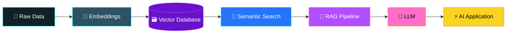
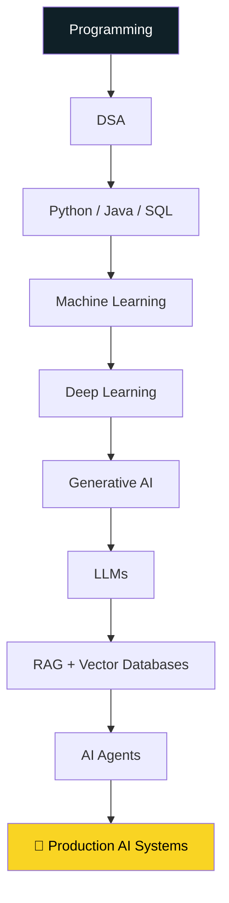
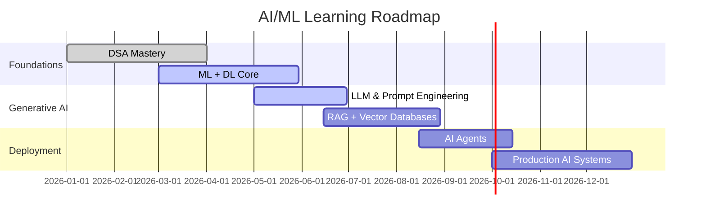

<!-- ================= 🌈 AI/ML ANIMATED HEADER (zero setup) ================= -->
<p align="center">
  
</p>

<p align="center">
  
</p>

<p align="center">
  <a href="https://linkedin.com/in/sri-ram-90287537b/"></a>
  <a href="https://leetcode.com/u/SriramMuthaiya/"></a>
  <a href="https://www.codechef.com/users/srirammuthaiya"></a>
  <a href="https://codolio.com/profile/SriramMuthaiya"></a>
  <a href="mailto:kit29.am48@gmail.com"></a>
</p>

---

## 🚀 About Me

I'm **Sriram M**, an aspiring **AI/ML Engineer** focused on building **intelligent, scalable, real-world applications** using Machine Learning, Generative AI, and modern software technologies.

- 🎓 Student at **KKIT – Kalaignar Karunanithi Institute of Technology**
- 🧠 Focused on **AI, ML, Generative AI, LLMs, RAG, Vector Databases, Backend Development, Cloud, and IoT**
- 🔍 Exploring how **LLMs, AI Agents, RAG pipelines, semantic search, and vector databases** combine into smarter applications
- 💻 Practicing **DSA** and sharpening problem-solving daily

---

## 🧬 My Generative AI Pipeline



---

## 🕸️ Skill Radar

<p align="center">
  
</p>

## 🍩 Focus Area Split

<p align="center">
  
</p>

> ✅ Every chart above is a plain image/markdown link generated live from a public URL — no GitHub Actions, no repo secrets, no workflow file needed anywhere. Nothing to break.

---

## 🏁 Live Competitive Programming Stats

**LeetCode**
<p align="center">
  
</p>

**CodeChef**
<p align="center">
  <a href="https://www.codechef.com/users/srirammuthaiya">
    
  </a>
</p>

**Codolio**
<p align="center">
  <a href="https://codolio.com/profile/SriramMuthaiya"></a>
</p>

---

## 🧠 What I'm Currently Exploring

```text
Generative AI         ███████████████████░   Learning
Large Language Models ██████████████████░░   Learning
RAG                   █████████████████░░░   Building
Vector Databases      ████████████████░░░░   Exploring
Machine Learning      ██████████████████░░   Building
Backend Development   █████████████████░░░   Building
Cloud Computing       ███████████████░░░░░   Exploring
IoT                   ███████████████░░░░░   Building
```

🤖 AI & ML · 🧠 Generative AI · 🔗 LLMs · 📚 RAG · 🗃️ Vector Databases · 🔎 Semantic Search · ⚡ AI Agents · ☁️ Cloud Computing · 🔌 IoT · 🏗️ Backend & API Dev · 📊 Data Science · 💻 DSA

---

## 🛠️ Tech Stack

**Languages**
<p></p>

**AI / ML**
<p></p>

Machine Learning · Deep Learning · NLP · Generative AI · LLM Applications · Model Training & Evaluation · Feature Engineering · Explainable AI · Anomaly Detection · Recommendation Systems

**Vector Databases:** `Pinecone` `ChromaDB` `Weaviate` `Qdrant` `Milvus` `LanceDB` `pgvector`

**Cloud & Backend:** `AWS EC2` `S3` `Lambda` `AWS IoT Core` `DynamoDB` `SNS` `REST APIs` `FastAPI` `Spring Boot` `Flask` `Node.js` `Express.js`

**Infrastructure:** `Docker` `Kubernetes` `Nginx` `Gunicorn` `Uvicorn`

**IoT & Smart Systems:** `ESP32` `Sensors` `MQTT` `AWS IoT Core` `ThingSpeak` `Cloud APIs` `Real-Time Monitoring`
> Sensors → Edge Devices → Cloud → AI/ML → Intelligent Decisions

**Data & Analytics:** `NumPy` `Pandas` `Matplotlib` `Scikit-learn` — Cleaning · Preprocessing · EDA · Feature Engineering · Model Eval · Visualization

<details>
<summary>🎨 More tools & platforms I use</summary><br>

                       

</details>

---

## 💻 Projects

| Project | Description | Tech |
|---|---|---|
| 🎓 **Student Management System** | C-based app to manage student info & basic operations | `C` |
| 🏫 **ERP Portal** | Web-based ERP-style platform for academic operations | `Python` |
| 🏥 **Medical Disease Prediction** | ML-based disease prediction from patient input features | `Python` `ML` |
| 🎙️ **Emotion Predictor Through Voice** | Predicts emotional states from voice data | `Python` `ML` `Audio` |
| 💳 **AI Loan Credit Predictor** | Predicts loan/credit outcomes using ML | `Python` `ML` |
| 🏥 **Medi-Core** | Healthcare project applying software & AI concepts | `Python` `AI/ML` |

---

## 🏗️ My Development Journey



## 🗓️ Roadmap (Next Milestones)



> ✅ Both diagrams above are native GitHub Mermaid — no image hosting involved, so they always render.

---

## 🎯 Current Goals

🚀 Production-ready AI apps · 🧠 Deepen Generative AI knowledge · 🔗 Advanced RAG systems · 🗃️ Master vector search · 🤖 Explore AI Agents · ☁️ Cloud deployment · 🏗️ Backend architecture · 💻 Strengthen DSA · 🌍 Open source

---

## 📈 GitHub Activity

<p align="center">
  
  
</p>

<p align="center">
  
</p>

## 🏆 GitHub Trophies

<p align="center">
  
</p>

---

<p align="center">
  
</p>

<p align="center"><i>🌈 Learn → Build → Break → Improve → Repeat 🌈</i></p>


